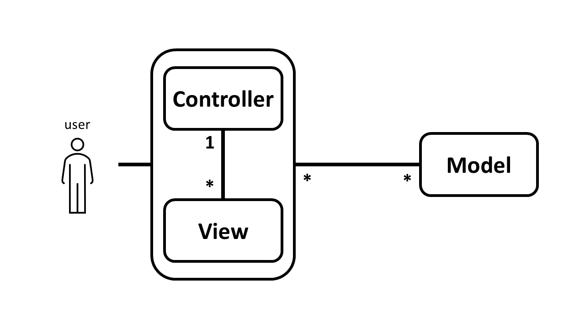
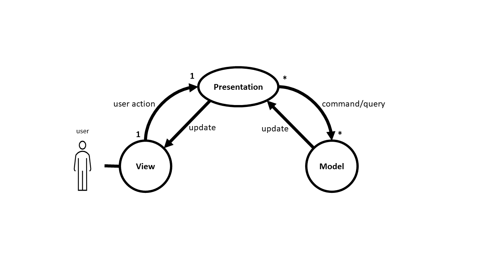

# 
MVC Pattern

## MVC

MVC is a software architectural pattern. It is included three component named, Model, View and Controller. So that,
users can interact with the Controller and send data to Model component with getting help from View, then View will get
the updates from model directly. The MVC uses for Desktop and Web application. Also, It has two variations named
Model-View-Presenter (MVP) and Model-View-ViewModel (MVVM)

### Model

It is a backend component included data, logic and rules of the data. Indeed, Model is a data model to represent the
knowledge.

### View

This part is a frontend component and, it is responsible to present the data and get input data from end user. Sometimes
View is named as a UI component. The View has no knowledge about the Controller.

### Controller

It is a component to make a relation between Model and View so that it is named the brain of application. The Controller
receive data and command from user with getting help from View, then makes a command for Model.

### Advantage

* Separation of concerns (SoC)
* Decoupling
* Testability
* Reusability

## MVP

MVP has three components, Model, View and Presentation. Indeed, Model and View are the same as Model and View in MVC and
Presentation is different component.

### Presentation

It is a component responsible to get input from View and make a command for Model, also getting model from
the Model to make a command for View to show the model.

### Advantage

* Separation of concerns (SoC)
* Decoupling
* Testability
* Reusability

## MVVM

### View Model

## Example

[mvc example](./mvc-example)

## References

* [PARC](http://wayback.archive-it.org/10370/20180425071111/http://folk.uio.no/trygver/themes/mvc/mvc-index.html)
* [Trygve M. H. Reenskaug](https://folk.universitetetioslo.no/trygver)
* [Martin Fowler](https://martinfowler.com/eaaDev/uiArchs.html)
* [Wild Crest](http://www.wildcrest.com/Potel/Portfolio/mvp.pdf)

**
 [Top](#MVC-Pattern) 
**

