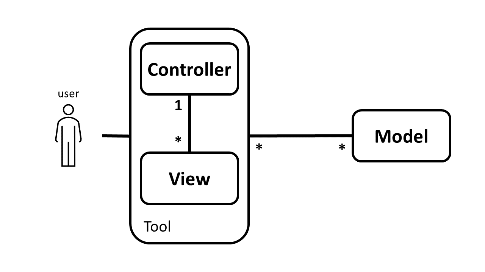
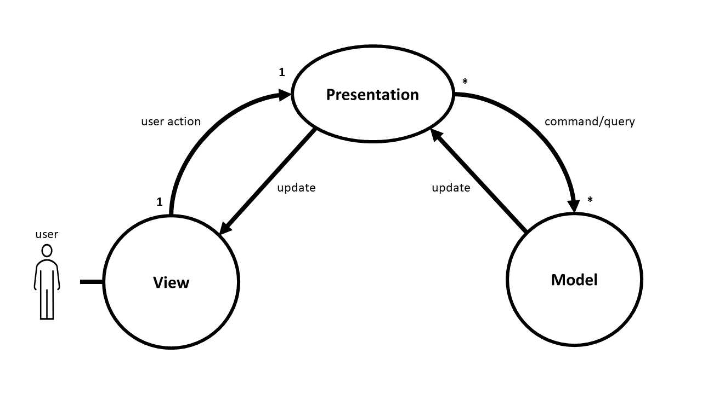
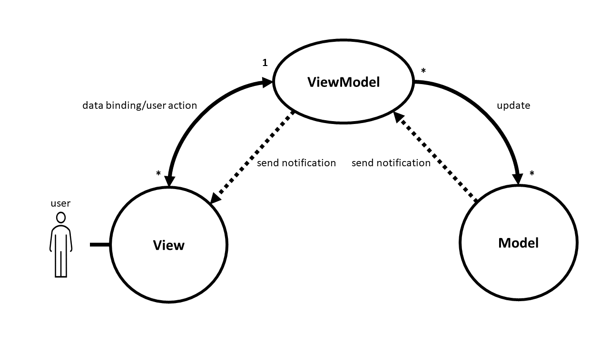

# 
MVC Pattern

## MVC

MVC is a software architectural pattern. It is included three components named, Model, View and Controller. So that,
users can interact with the Controller and send input to Controller component with getting help from View. Then View
will get the updates from model directly. The MVC generally uses for Desktop and Web application. Also, It has two
variations named Model-View-Presenter (MVP) and Model-View-ViewModel (MVVM)

### Model

It is a component included data, logic and rules of the data. Indeed, Model is a data model to represent the
knowledge of domain..

### View

This component is responsible to present the data and get input data from user. Sometimes View is named as a UI
component. The View has no knowledge about the Controller. View should receive the updated model from Model directly
and, it is included the same model, composite of models or a simpler version of a model. To get updated models there are
two solutions as follows.

* Use a reference of View in the Controller
* Use Observation pattern to get notification from Model directly

### Controller

It is a component to apply user request on Model so that it receive data and action from user with getting help from
View, then perform the action on Model. Controller is included two types of action as follows.

* Selection (an action to read data)
* Command (an action to manipulate data)

The Controller can be included View.

### Advantage

* Separation of concerns (SoC)
* Decoupling
* Testability
* Reusability

## MVP

Model-View-Presenter (MVP) is a software architectural pattern used in developing graphical user interface (GUI)
applications. It's a variation of the Model-View-Controller (MVC) pattern and aims to provide a clear separation of
concerns between the presentation logic and the business logic.

MVP has three components, Model, View and Presentation. Indeed, Model and View are the same as Model and View in MVC and
Presentation is different component.

### Presentation

It is a component responsible to get input and action from View and, perform the action on Model, also getting models
from the Model to provide it for View.

## MVVM

Model-View-ViewModel (MVVM) is a software architectural pattern used in development of modern user interfaces. It's a
variation of the Model-View-Controller (MVC) pattern and is widely used in developing applications with a graphical user
interface (GUI). MVVM is also referred to as Model=View-Binder.

MVVM has three components, Model, View and ViewModel. Indeed, Model and View are the same as Model and View in MVC and
ViewModel is different component. Also, the View communicates with the ViewModel through data binding, but has no direct
access to the Model.

### View Model

It's the intermediary component between the Model and the View. The ViewModel exposes the data from the Model in a
format that can be easily consumed by the View. It also handles the user interactions from the View and updates the
Model accordingly.

## Example

[MVC example](./mvc-example)

[MVP example](./mvp-example)

[MVVM example](./mvvm-example)

## References

* [PARC](http://wayback.archive-it.org/10370/20180425071111/http://folk.uio.no/trygver/themes/mvc/mvc-index.html)
* [Trygve M. H. Reenskaug](https://folk.universitetetioslo.no/trygver)
* [Martin Fowler](https://martinfowler.com/eaaDev/uiArchs.html)
* [Potel](http://www.wildcrest.com/Potel/Portfolio/mvp.pdf)
* [Microsoft](https://learn.microsoft.com/en-us/xamarin/xamarin-forms/enterprise-application-patterns/mvvm)
* [Microsoft](https://learn.microsoft.com/en-us/dotnet/architecture/maui/mvvm)
* [ChatGPT](https://chat.openai.com/chat)

**
 [Top](#MVC-Pattern) 
**

