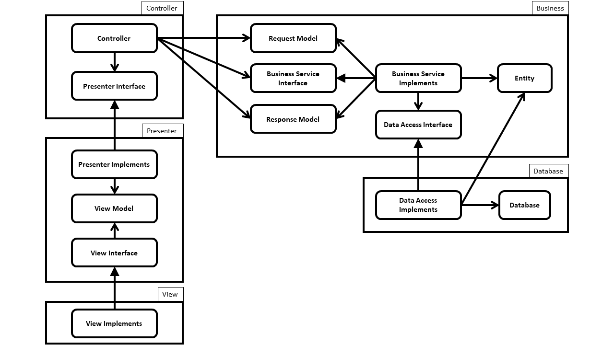

# <p align="center">SOLID Principles</p>

<p align="justify">

The SOLID principles tell us how to arrange our functions and data structures into classes, and how those classes should
be interconnected. The use of the word “class” does not imply that these principles are applicable only to
object-oriented software. A class is simply a coupled grouping of functions and data. Every software system has such
groupings, whether they are called classes or not. The SOLID principles apply to those groupings.

</p>

<p align="justify">

The goal of the principles is the creation of mid-level software structures that:

* Tolerate change,
* Are they easy to understand?
* Are they the basis of components that can be used in many software systems?

</p>

<p align="justify">

The term “mid-level” refers to the fact that these principles are applied by programmers working at the module level.
They are applied just above the level of the code and help to define the kinds of software structures used within
modules and components.

</p>

<p align="justify">

Just as it is possible to create a substantial mess with well-made bricks, so it is also possible to create a
system-wide mess with well-designed mid-level components. For this reason, once we have covered the SOLID principles, we
will move on to their counterparts in the component world, and then to the principles of high-level architecture.

</p>

* [Single Responsibility Principle (SRP)](#single-responsibility-principle-srp)
* [Open Close Principle (OCP)](#open-closed-principle-ocp)
* [The Liskov Substitution Principle (LSP)](#the-liskov-substitution-principle-lsp)
* [The Interface Segregation Principle (ISP)](#the-interface-segregation-principle-isp)
* [The dependency Inversion Principle](#the-dependency-inversion-principle)

## Single Responsibility Principle (SRP)

<p align="justify">

Software systems are changed to satisfy users and stakeholders; those users and stakeholders are the “reason to change”
that the principle is talking about.
Unfortunately, the words “user” and “stakeholder” aren’t really the right words to use here. There will likely be more
than one user or stakeholder who wants the system changed in the same way. Instead, we’re really referring to a
group—one or more people who require that change. We’ll refer to that group as an actor.
Thus, the final version of the SRP is: A module should be responsible to one, and only one, actor.
</p>

### What is Responsibility?

<p align="justify">

In the context of the Single Responsibility Principle (SRP) we define a responsibility to be “a reason for change.” If
you can think of more than one motive for changing a class, then that class has more than one responsibility.
Each responsibility is an axis of change. When the requirements change, that change will be manifest through a change in
responsibility amongst the classes. If a class assumes more than one responsibility, then there will be more than one
reason for it to change.
If a class has more than one responsibility, then the responsibilities become coupled. Changes to one responsibility may
impair or inhibit the class’ ability to meet the others. This kind of coupling leads to fragile designs that break in
unexpected ways when changed.

</p>

### Tip

<p align="justify">

In cases where the tests did not force the separation, and the smells of Rigidity and Fragility become strong, the
design should be refactored using the FACADE, DAO, or PROXY patterns to separate the two responsibilities.

</p>

## Open-Closed Principle (OCP)

<p align="justify">
the behavior of a software artifact ought to be extendible, without having to modify that artifact.
The OCP is one of the driving forces behind the architecture of systems. The goal is to make the system easy to extend without incurring a high impact of change. This goal is accomplished by partitioning the system into components, and arranging those components into a dependency hierarchy that protects higher-level components from changes in lower-level components.

</p>


<p align="center">



</p>

<p align="justify">

In the preceding figure, “Interactor/Business” component is a higher-level component, and the “view” component is a
lower-level
component.

</p>

### What is close?

<p align="justify">

If change requirements from actor and function, class, component and module, don’t need to change source code, we say
that function, class, component and module is closed to changes.

</p>

### Tip

<p align="justify">

When the member variables of a class change, every function that depends upon those
variables must be changed. Thus, no function that depends upon a variable can be closed
with respect to that variable.
In OOD, we expect that the methods of a class are not closed to changes in the member
variables of that class. However, we do expect that any other class, including subclasses
are closed against changes to those variables. We have a name for this expectation,
we call it: encapsulation.

</p>

### Tip

<p align="justify">

The abstraction is the key concept behind the open-close principle.

</p>

### Example

<p align="justify">

When we violate the open-closed principle?
If we use the if-else structure for checking the state of a variable, we violate OCP. Because, after adding a new state,
we should modify the if-else statement.

</p>

```java
public void mathod-name(Object param){

        if(a parameter-based condition)
        //doing sth
        }else if(another parameter-based condition){
        //doing sth
        }else{
        //doing sth
        }

        }


```

**<p align="center"> [Top](#SOLID-Principles) </p>**

## The Liskov Substitution Principle (LSP)

<p align="justify">

Functions that use pointers or references to base classes must be able to use objects of derived classes without knowing
it.
The above is a paraphrase of the Liskov Substitution Principle (LSP). Barbara Liskov first wrote it as follows:
What is wanted here is something like the following substitution property: If for each object o1 of type S there is an
object o2 of type T such that for all programs P defined in terms of T, the behavior of P is unchanged when o1 is
substituted for o2 then S is a subtype of T.

</p>

### Violate

<p align="justify">

If we use `instanceof` in code, then violate the Liskov Substitution Principle.

</p>

## The Interface Segregation Principle (ISP)

<p align="justify">

Clients should not be forced to depend upon interfaces that they do not use.
The interfaces of the class can be broken up into groups of member functions. Each group serves a different set of
clients. Thus, some clients use one group of member functions, and other clients use the other groups.

</p>

### Violate

<p align="justify">

If we implement method(s) of an interface with an empty body or just throw the not implemented exception, violate the
interface segregation principle.

</p>

## The dependency Inversion Principle

<p align="justify">

Use interface and abstraction instead of concrete class in modules, especially, when a module depends upon another
module.

</p>

### What’s bad design?

<p align="justify">

When rigidity, fragility or immobility exist in your application, then your application is badly designed.

</p>

### Rigidity
It is hard to change because every change affects too many other parts of the system

### Fragility
When you make a change, unexpected parts of the system break. (Fragility)

### Immobility
It is hard to reuse in another application because it cannot be disentangled from
the current application.


## References
* [Robert C. Marting Website](http://cleancoder.com/)
* [Clean Architecture by Robert C. Martin](https://www.amazon.com/dp/0134494164)

**<p align="center"> [Top](#solid-principles) </p>**


